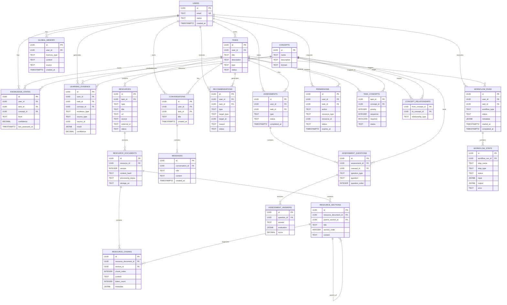

# Database ER Diagram

```mermaid
erDiagram

    USERS ||--o{ TASKS : owns
    USERS ||--o{ GLOBAL_MEMORY : has
    USERS ||--o{ KNOWLEDGE_STATES : has
    USERS ||--o{ LEARNING_EVIDENCE : generates
    USERS ||--o{ CONVERSATIONS : owns
    USERS ||--o{ ASSESSMENTS : takes
    USERS ||--o{ RECOMMENDATIONS : receives
    USERS ||--o{ WORKFLOW_RUNS : executes
    USERS ||--o{ PERMISSIONS : requests

    TASKS ||--o{ TASK_CONCEPTS : contains
    CONCEPTS ||--o{ TASK_CONCEPTS : mapped_to

    CONCEPTS ||--o{ CONCEPT_RELATIONSHIPS : source
    CONCEPTS ||--o{ CONCEPT_RELATIONSHIPS : target

    TASKS ||--o{ KNOWLEDGE_STATES : tracks
    CONCEPTS ||--o{ KNOWLEDGE_STATES : measures

    TASKS ||--o{ LEARNING_EVIDENCE : produces
    CONCEPTS ||--o{ LEARNING_EVIDENCE : concerns

    TASKS ||--o{ RESOURCES : contains
    RESOURCES ||--o{ RESOURCE_DOCUMENTS : versions

    RESOURCE_DOCUMENTS ||--o{ RESOURCE_SECTIONS : contains
    RESOURCE_SECTIONS ||--o{ RESOURCE_SECTIONS : parent_of

    RESOURCE_DOCUMENTS ||--o{ RESOURCE_CHUNKS : contains
    RESOURCE_SECTIONS ||--o{ RESOURCE_CHUNKS : organizes

    TASKS ||--o{ CONVERSATIONS : has
    CONVERSATIONS ||--o{ MESSAGES : contains

    TASKS ||--o{ ASSESSMENTS : has
    ASSESSMENTS ||--o{ ASSESSMENT_QUESTIONS : contains
    CONCEPTS ||--o{ ASSESSMENT_QUESTIONS : tests
    ASSESSMENT_QUESTIONS ||--o{ ASSESSMENT_ANSWERS : receives

    TASKS ||--o{ RECOMMENDATIONS : generates

    TASKS ||--o{ WORKFLOW_RUNS : triggers
    WORKFLOW_RUNS ||--o{ WORKFLOW_STEPS : contains

    TASKS ||--o{ PERMISSIONS : controls


    USERS {
        UUID id PK
        TEXT email UK
        TEXT status
        TIMESTAMPTZ created_at
    }

    GLOBAL_MEMORY {
        UUID id PK
        UUID user_id FK
        TEXT memory_type
        TEXT content
        TEXT source
        TIMESTAMPTZ created_at
    }

    TASKS {
        UUID id PK
        UUID user_id FK
        TEXT title
        TEXT description
        TEXT type
        TEXT status
    }

    CONCEPTS {
        UUID id PK
        TEXT name
        TEXT description
        TEXT domain
    }

    CONCEPT_RELATIONSHIPS {
        UUID from_concept_id FK
        UUID to_concept_id FK
        TEXT relationship_type
    }

    TASK_CONCEPTS {
        UUID task_id FK
        UUID concept_id FK
        INTEGER priority
        INTEGER sequence
        BOOLEAN required
        TEXT status
    }

    KNOWLEDGE_STATES {
        UUID id PK
        UUID user_id FK
        UUID task_id FK
        UUID concept_id FK
        TEXT level
        DECIMAL confidence
        TIMESTAMPTZ last_assessed_at
    }

    LEARNING_EVIDENCE {
        UUID id PK
        UUID user_id FK
        UUID task_id FK
        UUID concept_id FK
        TEXT evidence_type
        TEXT source_type
        UUID source_id
        JSONB result
        DECIMAL confidence
    }

    RESOURCES {
        UUID id PK
        UUID task_id FK
        TEXT type
        TEXT title
        TEXT url
        TEXT source
        TEXT external_id
        TEXT status
    }

    RESOURCE_DOCUMENTS {
        UUID id PK
        UUID resource_id FK
        INTEGER version
        TEXT content_hash
        TEXT processing_status
        TEXT storage_uri
    }

    RESOURCE_SECTIONS {
        UUID id PK
        UUID resource_document_id FK
        UUID parent_section_id FK
        TEXT title
        INTEGER section_order
        TEXT content
    }

    RESOURCE_CHUNKS {
        UUID id PK
        UUID resource_document_id FK
        UUID section_id FK
        INTEGER chunk_index
        TEXT content
        INTEGER token_count
        JSONB metadata
    }

    CONVERSATIONS {
        UUID id PK
        UUID user_id FK
        UUID task_id FK
        TEXT title
        TIMESTAMPTZ created_at
    }

    MESSAGES {
        UUID id PK
        UUID conversation_id FK
        TEXT role
        TEXT content
        TIMESTAMPTZ created_at
    }

    ASSESSMENTS {
        UUID id PK
        UUID user_id FK
        UUID task_id FK
        TEXT type
        TEXT status
        TIMESTAMPTZ completed_at
    }

    ASSESSMENT_QUESTIONS {
        UUID id PK
        UUID assessment_id FK
        UUID concept_id FK
        TEXT question_type
        TEXT question
        INTEGER question_order
    }

    ASSESSMENT_ANSWERS {
        UUID id PK
        UUID question_id FK
        TEXT answer
        JSONB evaluation
        DECIMAL score
    }

    RECOMMENDATIONS {
        UUID id PK
        UUID user_id FK
        UUID task_id FK
        TEXT type
        TEXT target_type
        UUID target_id
        TEXT reason
        TEXT status
    }

    WORKFLOW_RUNS {
        UUID id PK
        UUID user_id FK
        UUID task_id FK
        TEXT workflow_type
        TEXT status
        JSONB metadata
        TIMESTAMPTZ started_at
        TIMESTAMPTZ completed_at
    }

    WORKFLOW_STEPS {
        UUID id PK
        UUID workflow_run_id FK
        TEXT step_name
        TEXT step_type
        TEXT status
        JSONB input
        JSONB output
        TEXT error
    }

    PERMISSIONS {
        UUID id PK
        UUID user_id FK
        UUID task_id FK
        TEXT action
        TEXT resource_type
        UUID resource_id
        TEXT status
        TIMESTAMPTZ expires_at
    }
```